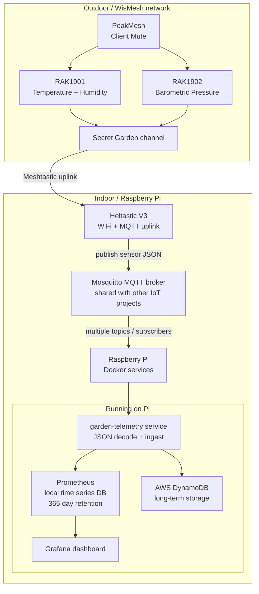

# Project to Connect WisMesh Sensors to Raspberry Pi running Grafana dashboard

# Overview
This project describes one person's journey to create a weather center for a backyard garden.

I started this when I stumbled into Meshtastic as an off-grid communication method and thought it might be useful to set up, since this area is prone to hurricanes and bad weather.

But then I saw that they have sensors ... hmmm!  This could be something!
I will eventually be building this out to a full weather station with a rain gauge and wind speed tracker, but I am starting small - just temperature/humidity and barometric pressure.

Going to try to document this so I know what I put together...

## Architecture

### The start:
- RAKwireless Mini Meshtastic Starter Kit US=915MHz RAK19003 + 4631
- RAK Wireless RAK1901 Temperature and Humidity Sensor
- RAK Wireless RAK1902 Barometric Pressure Sensor

Instead of the Meshtastic starter kit, I found the little [PeakMesh MicroMAG](https://www.etsy.com/listing/4346022155/peakmesh-micromag-smallest-outdoor) solar powered unit with a slot C and slot D for the sensor, so this answered the power question as well as "where am I going to put this node.

The only issue with this starter kit is that the sensors sit on the back, which is facing up towards the solar panel, so I had to buy some [RAK19005](https://store.rokland.com/products/rak-sensor-extension-cable-100025-copy) extension cables.  I got the whole system set up and feeding my local grafana dashboard, but before I deploy this outside, I need to address the location of the sensors, the extreme Southern humidity and keeping the PCBs dry during flooding rains.   I've investigated that and will describe my weatherproofing solution below

## WisMesh Setup

This part was a little more complex than I anticipated.
Meshtastic is a really great communication network, and I really appreciate having the ability to slice out private channels and frequencies, and I am still working through the optimal settings on these.  Our local mesh looks like there are many nodes, but they are not very active. So I think I have room to "learn some lessons" here. 

I have one Heltastic V3 (which includes Wifi) stationed inside the house, and my first node is my PeakMesh.  There will be more! 

Heltastic V3:  
   - LoRa / Region: US  
   - LoRa / Ok to MQTT: true  
   - LoRa / Transmit Enabled: true  
   - Channels:   
       0. Primary is still Longfast (I think this is wrong)  
       1. Secret Garden (private encrypted channel) 
           - MQTT Uplink Enabled: true   
   - Device / Role: Client  
   - Network / Enabled: true
   - Network / SSID: set up your local IOT wifi
   - Network / Password: enter your password - password shows in plain text in app?!
   - MQTT / Enabled: true  
   - MQTT / JSON Enabled: true  
   - MQTT / Root Topic: msh  (this just needs to match the topic used Python program processing messages)  
   - MQTT / Server
        - Address: (the IP address of yout MQTT broker server)
        I'm using the default listener (1883) since it's all local, but will look at filling out the username / password / SSL features as I get more comfortable with the architecture.  No sense learning how to do a thing if you can't learn how to do it securely, but I don't know what I don't know just yet.


   


PeakMesh:

   Security / Managed Device: true
   - LoRa / Region: US  
   - LoRa / Ok to MQTT: false
   - Channels:   
       0. Secret Garden (private encrypted channel)      
   - Device / Role: Client Mute  
   - Network / Enabled: false

## Raspberry Pi Setup


This was all my first time working with Raspberry Pi - so these are all bot first-pass code and I'm going to work on cleaning it up.

Just testing it to see if it works:
```
nohup python3 bridge.py > bridge.log 2>&1 &
```

Next natural step - move it to a service:

Run the Ansible deployment from the laptop/workstation:
```
ansible-playbook -i ansible/inventory.ini ansible/deploy_compose.yml
ansible-playbook -i ansible/inventory.ini ansible/deploy_garden_telemetry.yml
```
Verify on Pi:
```
sudo systemctl status garden-telemetry.service
sudo systemctl status garden-telemetry-compose.service
```


## Communication - wiring it up

The outdoor sensor node sends data over the private Secret Garden channel to the indoor Heltastic V3, which publishes MQTT messages to the shared broker on the Raspberry Pi. The Pi runs the MQTT broker and the garden-telemetry service, which decodes the JSON payloads and stores the resulting values in local Prometheus for 365 days while also sending them to AWS DynamoDB for long-term retention.



## Weatherproofing the outside deploy


## Troubleshooting

### Is Mosquitto getting your messages from Meshtastic MQTT
This will tail the mosquitto logs if you're ssh'd in:
```
docker exec -it mosquitto mosquitto_sub -h localhost -t "#" -v
```

### Is the garden-telemetry service processing the messages?
This will tail the service logs if you're ssh'd in:
```
sudo journalctl -u garden-telemetry.service -n 50 --no-pager
```

### Which processes are running as a service?
```
systemctl list-units --type=service
```

```
sudo systemctl status garden-telemetry.service
sudo systemctl status garden-telemetry-compose.service
```


### Why does 'docker compose ps' show this service restarting?
This shows the logs for a single service defined in the docker-compose file:
```
docker compose logs grafana --tail=120
```

This will follow the tail of the docker-compose service:
```
sudo journalctl -f -u garden-telemetry-compose.service
```

### Are the messages being saved in Prometheus
Query one of the data points that you set up in your code:
```
curl -s "http://localhost:9090/api/v1/query?query=garden_temperature_celsius" | jq
```

### Oy, just reboot this thing
```
sudo reboot
```
Alternative equivalent:
```
sudo systemctl reboot
```

## References I used

```
https://core-electronics.com.au/courses/meshtastic-for-makers-workshop/?fresh#KAEF1RG

https://www.youtube.com/watch?v=J4Z23yYmhvY&list=PLPK2l9Knytg6jzOfcqk5y0iBH48ZATVVD&index=7
```

Look into this one for upgrading MQTT security
```
http://www.steves-internet-guide.com/mossquitto-conf-file/
```

